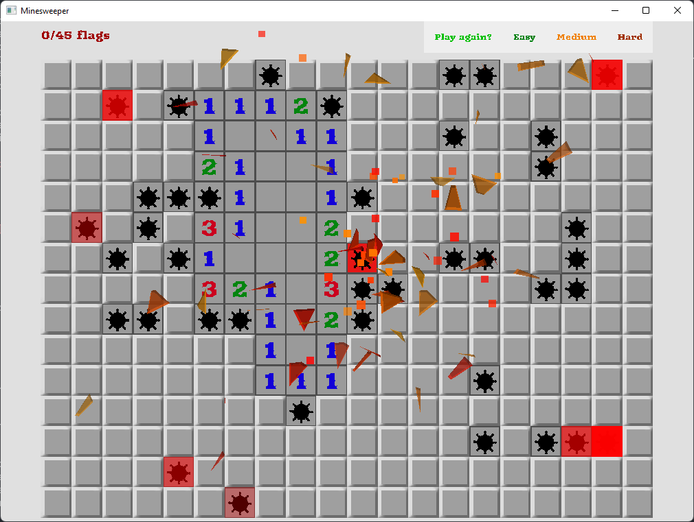

## Minesweeper

Pretty classic Minesweeper. Web Demo deployed [here](https://grassdne.github.io/sdlminesweeper/)!

This uses only [SDL2](https://www.libsdl.org/) and extension libraries [SDL_image](https://wiki.libsdl.org/SDL_image/), [SDL_ttf](https://wiki.libsdl.org/SDL_ttf/), and [SDL_mixer](https://wiki.libsdl.org/SDL_mixer/).

Built on Unix with Clang or GCC and Windows with MinGW. 
